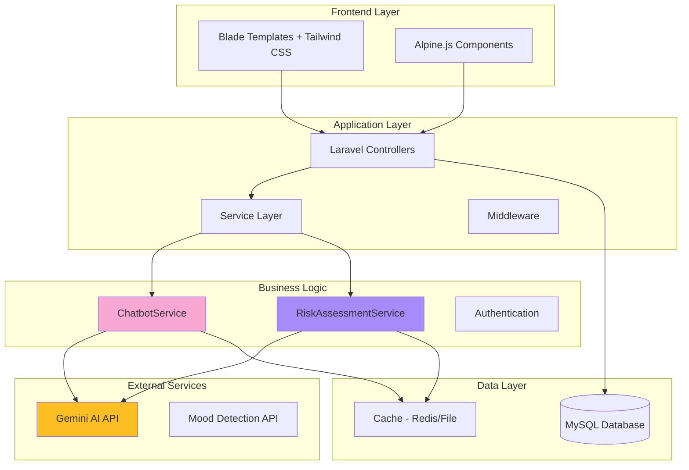
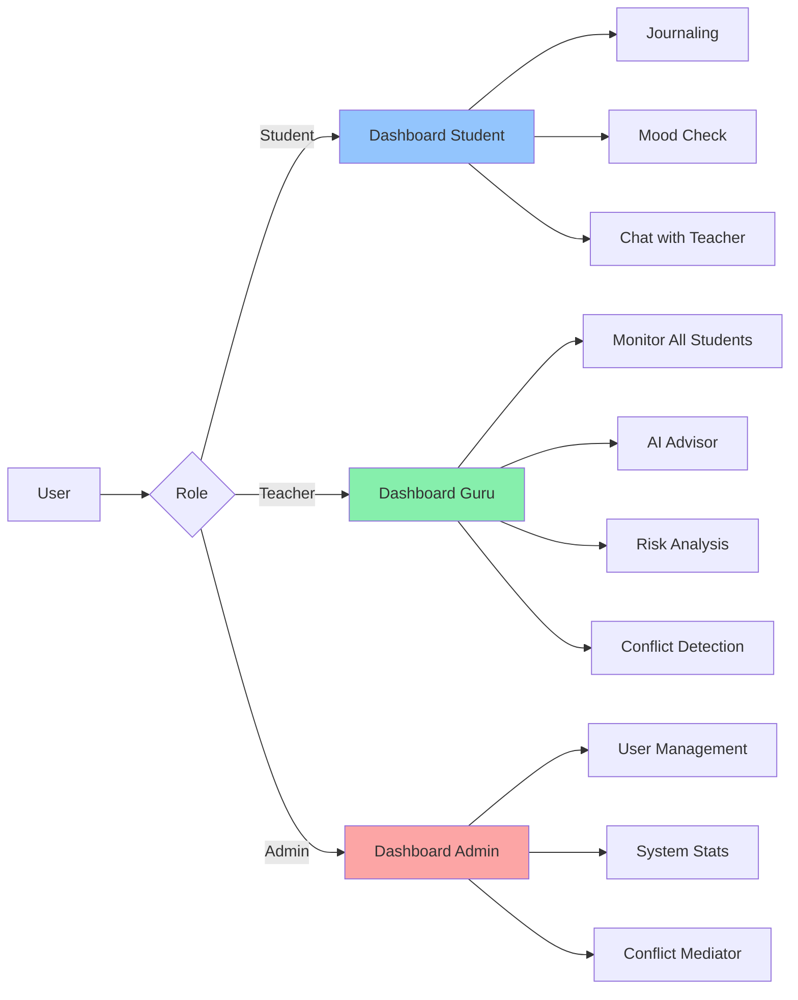
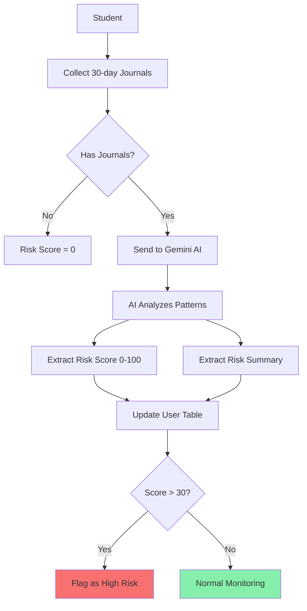
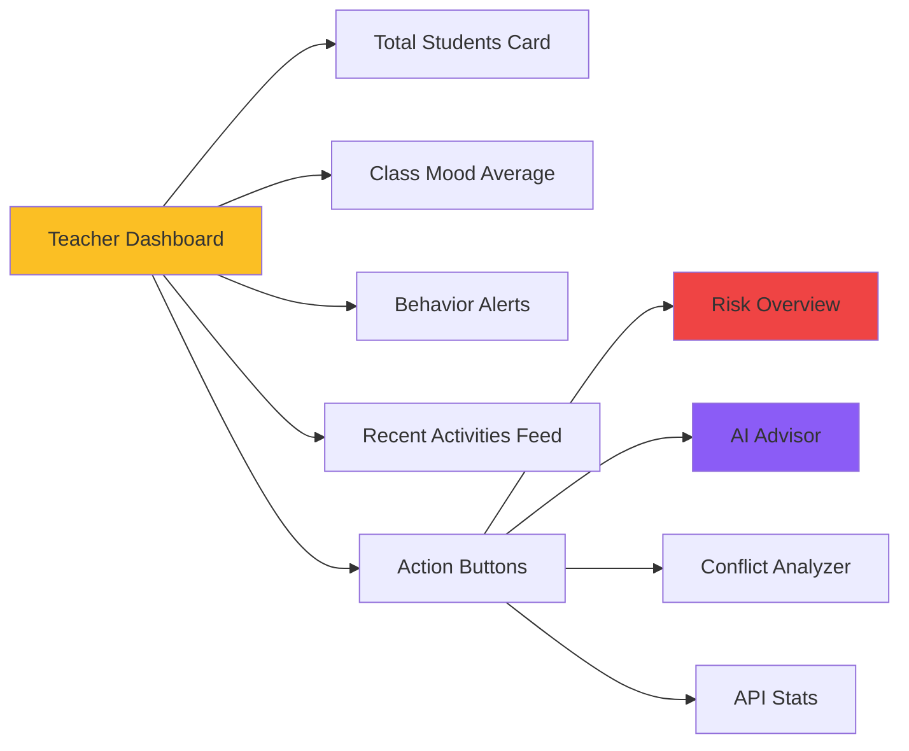
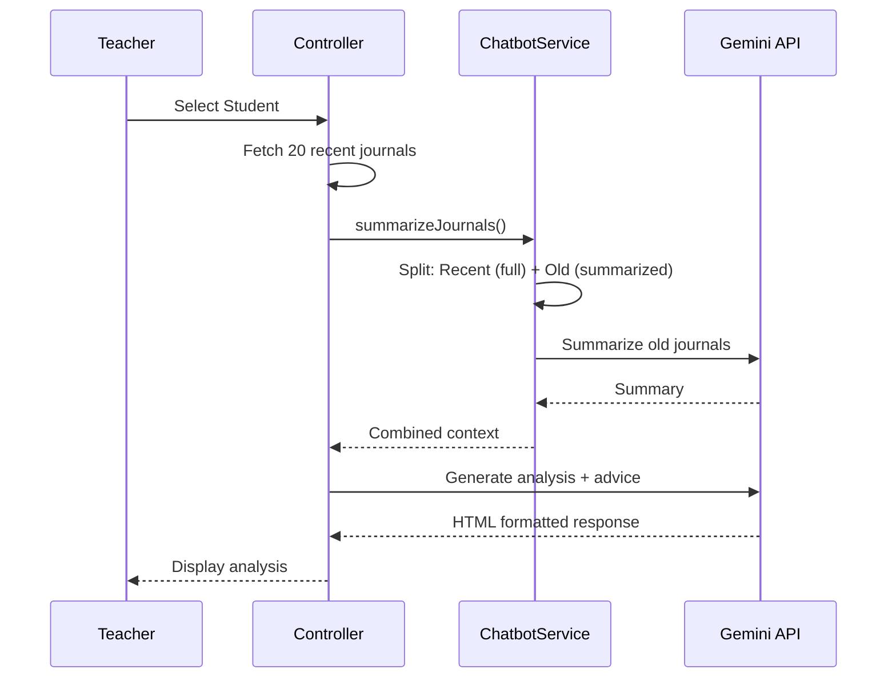
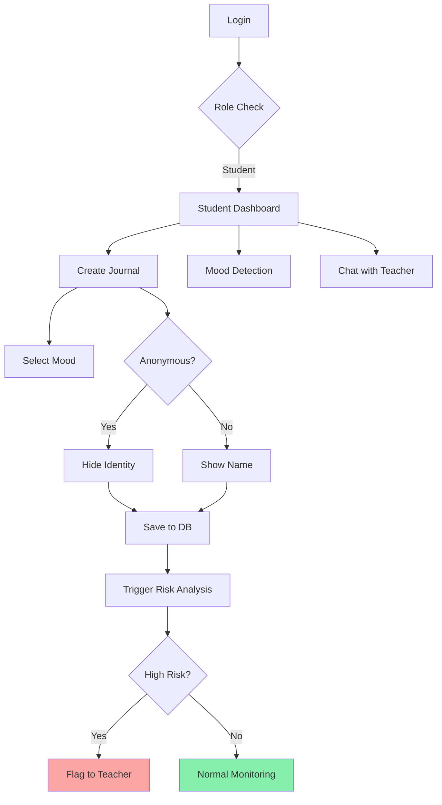
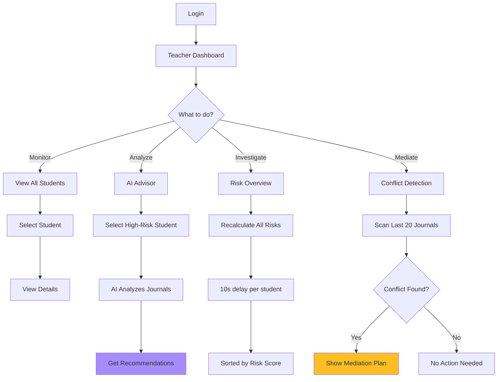

# 📋 **MENTAL HEALTH APP - Project Overview Komprehensif**

> **SerenityHub** - Platform Monitoring Kesehatan Mental Siswa Berbasis AI untuk Lingkungan Sekolah

---

## 📌 **Executive Summary**

**Mental Health App** (working name: SerenityHub) adalah aplikasi web berbasis Laravel yang dirancang untuk membantu sekolah dalam memonitor dan mendukung kesehatan mental siswa. Aplikasi ini mengintegrasikan **AI-powered analysis** menggunakan Google Gemini API untuk memberikan insight psikologis dan rekomendasi intervensi kepada guru.

### **Tujuan Utama**
1. 🎯 **Early Detection** - Mendeteksi siswa berisiko tinggi sedini mungkin
2. 🤝 **Teacher Support** - Memberikan guidance berbasis AI untuk guru
3. 📝 **Safe Expression** - Menyediakan ruang aman bagi siswa untuk mengekspresikan emosi
4. 📊 **Data-Driven Intervention** - Keputusan berbasis data dan analisis AI

---

## 🏗️ **System Architecture**



---

## 🛠️ **Technology Stack**

### **Backend Framework**
| Technology | Version | Purpose |
|------------|---------|---------|
| **PHP** | 8.2+ | Core language |
| **Laravel** | 12.0 | Web framework |
| **MySQL** | 5.7+ | Primary database |
| **Redis/File Cache** | - | Session & API rate limiting |

### **Frontend**
| Technology | Purpose |
|------------|---------|
| **Blade Templates** | Server-side rendering |
| **Tailwind CSS** | Utility-first styling |
| **Alpine.js** | Lightweight reactivity |
| **Vite** | Asset bundling & HMR |

### **AI & External Services**
| Service | Model | Purpose |
|---------|-------|---------|
| **Google Gemini API** | `gemini-2.0-flash` | Psychological analysis, conflict detection |
| **Mood Detection** | Custom | Facial recognition & voice analysis |

### **Development Tools**
- **Laravel Breeze** - Authentication scaffolding
- **Laravel Pail** - Log monitoring
- **Pest/PHPUnit** - Testing framework
- **Composer** - Dependency management
- **NPM** - Frontend dependencies

---

## 👥 **User Roles & Permissions**



### **Role Breakdown**

#### 1️⃣ **Student** (Siswa)
**Capabilities:**
- ✍️ Membuat journal entries (anonymous optional)
- 😊 Mood detection via camera/voice
- 💬 Chat dengan guru (counseling)
- 📊 View personal mood history

**Access Restrictions:**
- ❌ Cannot view other students' data
- ❌ No access to AI analysis tools

---

#### 2️⃣ **Teacher** (Guru/Konselor)
**Capabilities:**
- 👀 Monitor semua siswa di kelas
- 🤖 AI-powered psychological insights
- ⚠️ Risk assessment dashboard
- 🔍 Conflict detection antar siswa
- 💬 Receive student messages
- 📈 View API usage statistics

**Key Features:**
```php
// Teacher Dashboard Metrics
- Total Students
- Class Mood Average (real-time)
- High-Risk Students (risk_score > 30)
- Recent Journal Activities
- Conflict Alerts
```

---

#### 3️⃣ **Admin** (Administrator)
**Capabilities:**
- 👤 User creation & management
- 📊 System-wide statistics
- 🛠️ Conflict mediation tools
- 🔐 System configuration

---

## 🎯 **Core Features**

### **1. AI-Powered Chatbot & Analysis** 🤖

**Service:** `ChatbotService.php`

#### **Key Capabilities:**

##### a) **Psychological Consultation** (Teacher Copilot)
```php
System Prompt:
- Persona: "MindCare AI" - Expert assistant for teachers
- Framework: Restorative Justice + Non-Violent Communication
- Output: Actionable scripts in Bahasa Indonesia
- Safety: Immediate escalation for self-harm/violence risks
```

**Example Use Case:**
> **Teacher Input:** "Siswa X tidak mau bicara, terlihat murung"
> 
> **AI Output:**
> - Analisis psikologis (kemungkinan penyebab)
> - Script percakapan: "Coba katakan: 'Saya perhatikan kamu terlihat...' "
> - Red flags to watch for
> - When to escalate to professional

---

##### b) **Journal Conflict Detection**
```php
Functionality:
1. Scan 20 latest journal entries
2. Pre-filter by negative mood OR conflict keywords
3. Detect interpersonal conflicts between students
4. Generate mediation strategies
```

**Conflict Keywords:**
```php
['berantem', 'musuh', 'benci', 'ejek', 'bully', 'pukul', 
 'tampar', 'sindir', 'curang', 'bohong', 'ancam', ...]
```

**Output Format:**
```html
⚠️ Conflict Detected: Student A vs Student B
Evidence: [Quotes from journals]
Suggested Action: [Step-by-step mediation plan]
```

---

##### c) **Token Optimization Strategies**
| Strategy | Implementation | Token Savings |
|----------|---------------|---------------|
| **Journal Summarization** | Old journals → AI summary, Recent → Full detail | ~60% |
| **Cached System Prompts** | Reuse persona definition | ~30% |
| **Smart Filtering** | Only analyze negative/conflict entries | ~70% |
| **Rate Limiting** | 5s global delay + exponential backoff | Prevents quota waste |

**Token Tracking:**
```php
Daily Metrics:
- total_requests
- total_prompt_tokens
- total_completion_tokens
- per_session_tokens (individual user monitoring)

Storage: Cache with 30-day retention
```

---

### **2. Risk Assessment System** ⚠️

**Service:** `RiskAssessmentService.php`

#### **Risk Calculation Logic**


#### **Database Schema**
```sql
users table:
- risk_score (integer, default: 0)
- risk_summary (text, nullable)
- risk_last_updated_at (timestamp)
```

#### **AI Prompt for Risk Assessment**
```
Analyze journals for:
1. Suicidal ideation keywords ("mati", "bunuh diri", "hilang")
2. Emotional patterns (persistent sadness, anger)
3. Social isolation indicators
4. Behavioral changes

Output JSON:
{
  "risk_score": 0-100,
  "summary": "Brief risk factors explanation"
}
```

---

### **3. Journal System** 📝

**Controller:** `JournalController.php`

#### **Features:**
- ✍️ Create entries with title + content + mood
- 🔒 **Anonymous mode** (hides identity from teacher)
- 🗑️ Delete own entries
- 📊 Chronological viewing

#### **Database Schema**
```sql
journals table:
- id (bigint, primary key)
- user_id (foreign key → users)
- title (string)
- content (text)
- mood (string: happy/calm/neutral/sad/angry)
- is_anonymous (boolean, default: false)
- timestamps
```

#### **Mood Categories**
```php
Mood Map:
- happy  → 😄 (yellow)
- calm   → 😌 (blue)
- neutral → 😐 (gray)
- sad    → 😢 (purple)
- angry  → 😠 (red)
```

---

### **4. Mood Detection** 😊

**Features:**
- 📷 **Facial Recognition** - Analyze emotions from camera
- 🎤 **Voice Analysis** - Detect mood from speech patterns
- ⚡ Real-time processing
- 📈 Store results in journal

**Note:** Requires FFmpeg untuk audio transcription (Whisper AI)

---

### **5. Teacher Dashboard** 📊

**Route:** `/teacher/dashboard`

#### **Dashboard Widgets:**



#### **Key Metrics:**
1. **Total Students Count**
2. **Dominant Mood Today** - Based on today's journal entries
3. **High-Risk Students** - `risk_score > 30`
4. **Recent Activities** - Last 10 journal entries with user info

---

### **6. AI Advisor** 🧠

**Route:** `/teacher/ai-advisor/{studentId}`

**Flow:**


**Output Includes:**
- 📊 Analisis Situasi (psychological context)
- ⚠️ Prioritas Utama (immediate concerns)
- 💬 Recommended Scripts (exact words to say)
- 🎯 Langkah Aksi (step-by-step action plan)

**Customization:**
- Teacher dapat ajukan pertanyaan spesifik
- AI merespon dengan context dari journals

---

### **7. Chat/Counseling System** 💬

**Routes:**
```php
GET  /chat              - Chat interface
GET  /chat/teachers     - Available teachers list
GET  /chat/messages/{userId} - Fetch message history
POST /chat/send         - Send message
POST /chat/read/{id}    - Mark as read
GET  /chat/unread       - Unread count
```

**Database:** `messages` table
```sql
- id
- sender_id (foreign key)
- receiver_id (foreign key)
- content (text)
- is_read (boolean)
- timestamps
```

**Use Case:** Students can privately chat with teachers for counseling.

---

## 🔐 **Security & Privacy**

### **Data Protection**
| Aspect | Implementation |
|--------|---------------|
| **Authentication** | Laravel Breeze (session-based) |
| **Password Hashing** | bcrypt (Laravel default) |
| **API Key Security** | Environment variables only |
| **Anonymous Journals** | `is_anonymous` flag hides student identity |
| **Role-based Access** | Middleware checks (planned) |

### **Privacy Concerns** ⚠️
> **CRITICAL:** Mental health data adalah **highly sensitive**

**Recommended Improvements:**
1. 🔒 **Encrypt journal content** at rest
2. 📜 **Consent mechanism** - Student must approve data sharing
3. 🗓️ **Data retention policy** - Auto-delete old entries
4. 📥 **Data export** - GDPR compliance (user can download their data)
5. 🛡️ **Audit logging** - Track who accessed what data

---

## 🚨 **Rate Limiting & API Management**

### **Gemini API Limits**
```php
Global Rate Limit:
- Minimum 5 seconds between ANY API calls
- Implemented via Cache timestamping

Exponential Backoff (429 errors):
- Attempt 1: Wait 8 seconds
- Attempt 2: Wait 16 seconds  
- Attempt 3: Wait 32 seconds (capped at 60s)

Max Retries: 3
Timeout: 30 seconds
```

### **Throttle Middleware**
```php
Route::middleware(['throttle.gemini'])->group(function () {
    // Protected AI routes
});
```

### **Token Budget Monitoring**
```php
Daily Stats (cached):
- total_requests
- total_tokens
- cost estimation (if needed)

Per-Session Tracking:
- Detect individual user abuse
- Fair usage enforcement
```

**Dashboard:** `/teacher/api-stats` untuk monitoring real-time

---

## 📊 **Database Schema**

```mermaid
erDiagram
    users ||--o{ journals : creates
    users ||--o{ messages : sends
    users ||--o{ messages : receives
    
    users {
        bigint id PK
        string name
        string email UK
        string password
        enum role
        integer risk_score
        text risk_summary
        timestamp risk_last_updated_at
    }
    
    journals {
        bigint id PK
        bigint user_id FK
        string title
        text content
        string mood
        boolean is_anonymous
        timestamps
    }
    
    messages {
        bigint id PK
        bigint sender_id FK
        bigint receiver_id FK
        text content
        boolean is_read
        timestamps
    }
```

---

## 🔄 **Application Workflows**

### **Student Journey**


---

### **Teacher Journey**


---

## 🚀 **Deployment Considerations**

### **System Requirements**
```yaml
Server:
  PHP: >= 8.2
  Memory: 512MB minimum (1GB recommended)
  Storage: 2GB+ for logs & media
  
Database:
  MySQL: 5.7+ or PostgreSQL 12+
  
Optional:
  Redis: For caching (recommended for production)
  FFmpeg: For audio processing (mood detection)
```

### **Environment Variables**
```env
# Core
APP_ENV=production
APP_DEBUG=false
APP_URL=https://yourdomain.com

# Database
DB_CONNECTION=mysql
DB_HOST=127.0.0.1
DB_DATABASE=mental_health_app
DB_USERNAME=root
DB_PASSWORD=

# AI Services
GEMINI_API_KEY=your_api_key_here
GEMINI_MODEL=gemini-2.0-flash

# Cache
CACHE_DRIVER=redis  # or 'file' for simple setup
SESSION_DRIVER=redis
```

### **Production Checklist**
- [ ] Enable HTTPS (SSL certificate)
- [ ] Configure queue workers for background jobs
- [ ] Set up automated backups (database + uploaded files)
- [ ] Configure error monitoring (Sentry/Bugsnag)
- [ ] Implement log rotation
- [ ] Set up firewall rules
- [ ] Enable API rate limiting at server level
- [ ] Encrypt sensitive database columns
- [ ] Review and harden CORS policies

---

## 🐛 **Known Issues & Technical Debt**

### **Critical** 🔴
1. **Leftover E-commerce Code**
   ```php
   // User.php - REMOVE THESE
   isSeller(), store(), buyer() 
   ```
   **Impact:** Will cause errors if called
   **Fix:** Delete unused methods

2. **Missing Encryption**
   - Journal content stored in plain text
   - Risk summaries visible in database
   **Fix:** Implement Laravel encryption casts

---

### **High Priority** 🟡
3. **No Real-time Chat**
   - Chat requires manual refresh
   **Fix:** Implement Laravel Echo + Pusher/Reverb

4. **Model Name Inconsistency**
   ```php
   Line 13: gemini-2.0-flash
   Line 165: gemini-1.5-flash  // Fallback mismatch
   ```

5. **Missing Unit Tests**
   - No tests for ChatbotService
   - No tests for RiskAssessmentService

---

### **Medium Priority** 🟢
6. **Magic Numbers in Code**
   ```php
   sleep(10);           // Should be config('services.gemini.delay')
   risk_score > 30      // Should be config('risk.threshold')
   ```

7. **No Student Consent Mechanism**
   - Teachers can view all journals without explicit permission

8. **Limited Documentation**
   - README hanya 21 lines
   - No API documentation

---

## 📈 **Future Roadmap**

### **Phase 1: Stability** (1-2 Weeks)
- ✅ Fix leftover code
- ✅ Add comprehensive logging
- ✅ Create proper README
- ✅ Implement automated tests

### **Phase 2: Enhancement** (1 Month)
- 🔄 Real-time chat (WebSocket)
- 📊 Analytics dashboard with charts
- 🔐 Student consent management
- 🤖 Fallback chatbot (rule-based)

### **Phase 3: Scale** (2-3 Months)
- 🌍 Multi-language support
- 📱 Mobile app (Flutter/React Native)
- 👪 Parent dashboard (with permissions)
- 🔗 Integration dengan SIS sekolah

### **Phase 4: AI Enhancement**
- 📝 Sentiment analysis on chat messages
- 🎯 Predictive risk modeling (ML)
- 🗣️ Voice-to-text journaling
- 🌐 Multi-modal AI (image + text analysis)

---

## 🎓 **Technical Quality Assessment**

### **Strengths** ✅
- Clean separation of concerns (Services, Controllers)
- Proper use of Laravel best practices
- Sophisticated AI integration
- Comprehensive error handling in AI service
- Well-structured routing

### **Weaknesses** ❌
- Missing unit tests
- Hard-coded configuration values
- Leftover code from previous projects
- No encryption for sensitive data
- Limited role-based access control

### **Overall Score: 7.5/10**
> Excellent concept with solid execution, needs refinement in security and code quality.

---

## 📚 **Key Files Reference**

| File | Purpose | Lines |
|------|---------|-------|
| [`ChatbotService.php`](file:///c:/laragon/www/Project-Kesehatan-mental/app/Services/ChatbotService.php) | AI integration & token management | 366 |
| [`RiskAssessmentService.php`](file:///c:/laragon/www/Project-Kesehatan-mental/app/Services/RiskAssessmentService.php) | Student risk calculation | ~150 |
| [`Teacher/DashboardController.php`](file:///c:/laragon/www/Project-Kesehatan-mental/app/Http/Controllers/Teacher/DashboardController.php) | Teacher features hub | 227 |
| [`JournalController.php`](file:///c:/laragon/www/Project-Kesehatan-mental/app/Http/Controllers/JournalController.php) | Journal CRUD | 48 |
| [`web.php`](file:///c:/laragon/www/Project-Kesehatan-mental/routes/web.php) | Application routes | 111 |

---

## 🎯 **Conclusion**

**Mental Health App** adalah project yang **sangat promising** dengan potensi impact sosial yang besar. Implementasi AI yang sophisticated dan fokus pada user experience membuatnya stand out. 

**Kunci Sukses:**
1. ✅ Inovasi fitur (AI Advisor, Conflict Detection)
2. ✅ Architecture yang scalable
3. ✅ Fokus pada real-world problem

**Prioritas Perbaikan:**
1. 🔒 Security & privacy enhancements
2. 🧪 Automated testing
3. 📖 Better documentation
4. 🧹 Code cleanup (remove legacy)

---

**Next Steps:** Pilih salah satu area prioritas untuk dikerjakan, atau lanjutkan dengan feature development berdasarkan roadmap di atas. 🚀
