# 📚 **LANDASAN TEORETIS & PEDAGOGIS**
# Mental Health App (SerenityHub)

> **Framework Pendidikan Kesehatan Mental Berbasis Bukti Ilmiah**

---

## 🎯 **Rasional Akademis**

Aplikasi ini dirancang berdasarkan **Multi-Tiered System of Support (MTSS)** dan **Social-Emotional Learning (SEL) Framework** yang telah terbukti efektif dalam konteks pendidikan. Pendekatan ini mengintegrasikan teori psikologi perkembangan, konseling sekolah, dan teknologi pendidikan untuk menciptakan **sistem deteksi dini dan intervensi proaktif** terhadap isu kesehatan mental siswa.

---

## 🧠 **Kerangka Teoretis Utama**

### **1. Multi-Tiered System of Support (MTSS)**

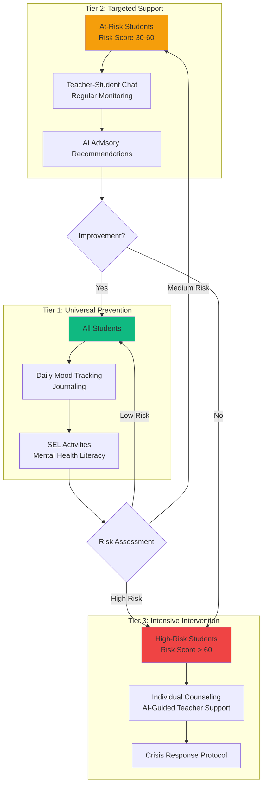

#### **Implementasi dalam Aplikasi:**

| Tier | Teori | Implementasi Teknis |
|------|-------|---------------------|
| **Tier 1** | Universal Prevention | ✅ Journal system untuk semua siswa<br/>✅ Mood detection tools<br/>✅ Accessible mental health resources |
| **Tier 2** | Targeted Intervention | ✅ Risk score 30-60 → flagged to teacher<br/>✅ AI Advisor memberikan strategi spesifik<br/>✅ Chat counseling dengan guru |
| **Tier 3** | Intensive Support | ✅ Risk score > 60 → prioritas tertinggi<br/>✅ Detailed psychological analysis<br/>✅ Actionable crisis scripts untuk guru |

**Referensi Teoretis:**
> McIntosh, K., & Goodman, S. (2016). *Integrated Multi-Tiered Systems of Support: Blending RTI and PBIS*. Guilford Press.

---

### **2. Social-Emotional Learning (SEL) Framework**

**CASEL's 5 Core Competencies** yang diintegrasikan:

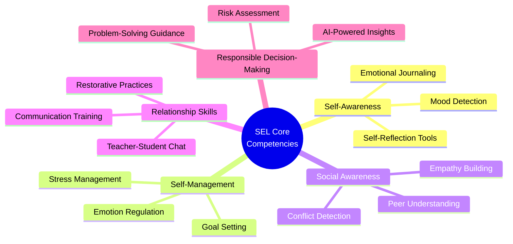

#### **Mapping Fitur ke Kompetensi SEL:**

| Kompetensi SEL | Fitur Aplikasi | Mekanisme Pedagogis |
|----------------|----------------|---------------------|
| **Self-Awareness** | Mood Detection + Journal | Siswa belajar **mengenali** dan **melabeli** emosi mereka secara akurat |
| **Self-Management** | Anonymous Journaling | Safe space untuk **ekspresikan** emosi tanpa judgment, latihan regulasi emosi |
| **Social Awareness** | Conflict Detection (AI) | Guru memahami **dinamika sosial** tersembunyi di kelas |
| **Relationship Skills** | Teacher-Student Chat | Membangun **komunikasi terapeutik** yang aman dan suportif |
| **Responsible Decision-Making** | AI Advisor | Guru mendapat **data-driven insights** untuk keputusan intervensi |

**Referensi:**
> CASEL (2020). *CASEL's SEL Framework*. Collaborative for Academic, Social, and Emotional Learning.

---

### **3. Restorative Justice Framework**

Aplikasi ini menerapkan **Restorative Practices** sebagai alternatif dari pendekatan punitive tradisional.

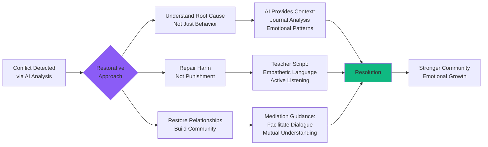

#### **Prinsip Restorative Justice dalam Kode:**

```php
// Dari ChatbotService.php, System Prompt untuk AI
"Guidelines:
1. **Never judge or scold.** Be supportive to the teacher.
2. **Provide Context.** Explain *why* a student might be acting out 
   (e.g., hidden stress, trauma).
3. **Actionable Scripts.** Give the teacher exact words to say. 
   Example: 'Try saying: I noticed you seem down...'
4. **Safety First.** If there is a risk of self-harm or violence, 
   advise immediate professional intervention."
```

**Kontras dengan Pendekatan Punitive:**

| Punitive Approach | Restorative Approach (App) |
|-------------------|----------------------------|
| ❌ "Siapa yang salah?" | ✅ "Apa yang terjadi? Mengapa ini terjadi?" |
| ❌ Hukuman/sanksi | ✅ Pemahaman + perbaikan relasi |
| ❌ Isolasi pelaku | ✅ Reintegrasi ke komunitas |
| ❌ Teacher sebagai "judge" | ✅ Teacher sebagai "facilitator" |

**Referensi:**
> Zehr, H. (2015). *The Little Book of Restorative Justice*. Good Books.

---

### **4. Non-Violent Communication (NVC)**

Model NVC dari **Marshall Rosenberg** diintegrasikan dalam AI-generated teacher scripts.

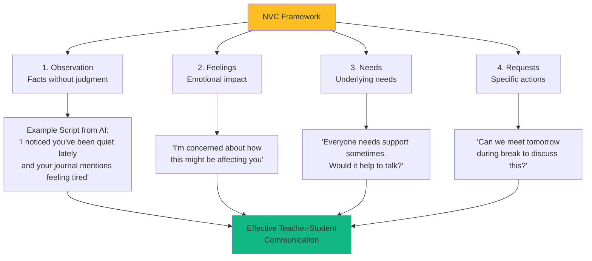

**Implementasi dalam AI Advisor:**

```
AI Output Example:
"**Apa yang harus Bapak/Ibu Guru katakan:**
> "Azid, saya perhatikan kamu sepertinya punya sesuatu yang 
  mengganggu pikiran (OBSERVATION). Saya di sini untuk 
  mendengarkan, bukan untuk menghakimi (NEEDS). Apapun yang 
  kamu ceritakan aman bersama saya (REQUEST for trust)."
```

**Referensi:**
> Rosenberg, M. B. (2015). *Nonviolent Communication: A Language of Life*. PuddleDancer Press.

---

### **5. Trauma-Informed Care**

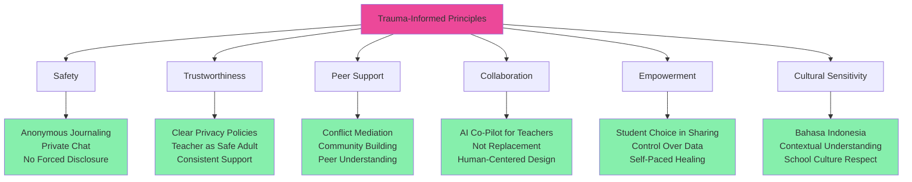

**Trauma-Informed Features:**

| Prinsip | Implementasi Teknis | Manfaat Pedagogis |
|---------|---------------------|-------------------|
| **Safety** | `is_anonymous` flag di journal | Siswa dgn trauma merasa aman ekspresikan diri tanpa takut exposure |
| **Trustworthiness** | Transparent risk scoring | Guru dapat dipercaya karena keputusan berbasis data, bukan asumsi |
| **Empowerment** | Student controls own data | Autonomy → healing, bukan dipaksa "share" sebelum siap |
| **Collaboration** | AI + Teacher partnership | Bukan "surveillance system", tapi support system |

**Referensi:**
> SAMHSA (2014). *SAMHSA's Concept of Trauma and Guidance for a Trauma-Informed Approach*. U.S. Department of Health and Human Services.

---

## 🔬 **Model Psikologi yang Diterapkan**

### **1. Bronfenbrenner's Ecological Systems Theory**

Aplikasi memahami bahwa perilaku siswa dipengaruhi oleh **multiple systems**:

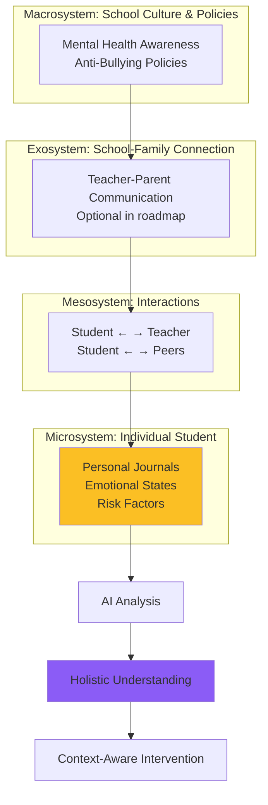

**Contoh Aplikasi:**
- **Microsystem:** Journal entries capture individual emotional state
- **Mesosystem:** Conflict detection antar siswa (peer interactions)
- **Exosystem:** Teacher dashboard (school support system)
- **Macrosystem:** AI trained on restorative justice values (cultural context)

**Referensi:**
> Bronfenbrenner, U. (1979). *The Ecology of Human Development*. Harvard University Press.

---

### **2. Self-Determination Theory (SDT)**

**Motivation & Well-being** melalui 3 kebutuhan psikologis dasar:

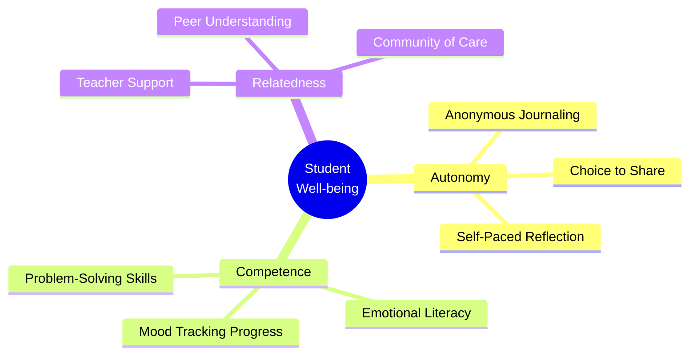

| Kebutuhan SDT | Feature yang Mendukung | Outcome Psikologis |
|---------------|------------------------|-------------------|
| **Autonomy** | Student pilih anonymous/public journal | ↑ Intrinsic motivation untuk self-reflect |
| **Competence** | Mood detection → feedback loop | ↑ Emotional self-efficacy |
| **Relatedness** | Teacher chat → supportive relationship | ↑ Sense of belonging, ↓ isolation |

**Referensi:**
> Ryan, R. M., & Deci, E. L. (2000). Self-determination theory and the facilitation of intrinsic motivation. *American Psychologist*, 55(1), 68-78.

---

### **3. Cognitive-Behavioral Theory (CBT)**

Journaling adalah bentuk **Cognitive Restructuring**:

```mermaid
graph LR
    A[Negative Event<br/>School Conflict] --> B[Automatic Thought<br/>"Semua benci aku"]
    
    B --> C[Emotional Response<br/>Sadness, Anger]
    
    C --> D[Behavioral Consequence<br/>Withdrawal, Aggression]
    
    D --> E[Journaling Intervention]
    
    E --> F[Reflection:<br/>Write down thoughts<br/>Identify patterns]
    
    F --> G[AI Analysis:<br/>Spot cognitive distortions<br/>Suggest reframing]
    
    G --> H[Teacher Support:<br/>Guide rational thinking<br/>Challenge beliefs]
    
    H --> I[New Perspective<br/>"Some people care about me"]
    
    I --> J[Positive Loop:<br/>Improved mood<br/>Better coping]
    
    style B fill:#fca5a5
    style E fill:#fbbf24
    style I fill:#86efac
    style J fill:#10b981
```

**Mekanisme CBT dalam App:**
1. **Thought Recording:** Journaling = externalize thoughts
2. **Pattern Recognition:** AI detects repeated negative themes
3. **Behavioral Activation:** Teacher suggests activities (via recommendations)
4. **Cognitive Reframing:** AI teaches teacher how to guide student's reinterpretation

**Referensi:**
> Beck, J. S. (2011). *Cognitive Behavior Therapy: Basics and Beyond*. Guilford Press.

---

## 📊 **Model Intervensi Preventif**

### **Response to Intervention (RTI) Mental Health Model**

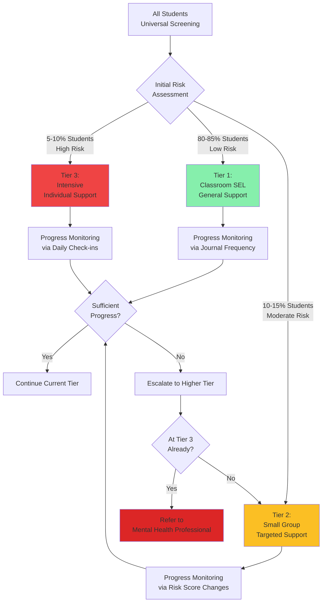

**Data-Driven Decision Making:**

```php
// Dari RiskAssessmentService.php
if ($student->risk_score > 60) {
    // Tier 3: Intensive - Immediate teacher notification
    // AI provides detailed analysis + crisis scripts
} elseif ($student->risk_score > 30) {
    // Tier 2: Targeted - Flag for monitoring
    // Regular check-ins via chat
} else {
    // Tier 1: Universal - Continue journaling
    // Positive reinforcement
}
```

**Referensi:**
> Dowdy, E., et al. (2015). Screening for mental health in schools. In *Handbook of Response to Intervention in School Psychology* (pp. 171-196). Springer.

---

## 🎓 **Pedagogical Best Practices**

### **1. Developmentally Appropriate Practice (DAP)**

**Prinsip:** Intervention harus sesuai dengan **tahap perkembangan** siswa.

| Usia/Tahap | Karakteristik Perkembangan | Adaptasi Aplikasi |
|------------|----------------------------|-------------------|
| **12-14 tahun<br/>(SMP Awal)** | Abstract thinking mulai berkembang<br/>Peer influence tinggi | ✅ Mood labels sederhana (emoji)<br/>✅ Conflict detection antar teman<br/>✅ Anonymous option (peer pressure) |
| **15-17 tahun<br/>(SMP Akhir-SMA)** | Identity formation<br/>Emotional complexity meningkat | ✅ Detailed journaling<br/>✅ AI-generated psychological insights<br/>✅ Self-directed reflection |

**Recommendation:** Add **age-specific prompts** di future update.

---

### **2. Culturally Responsive Teaching**

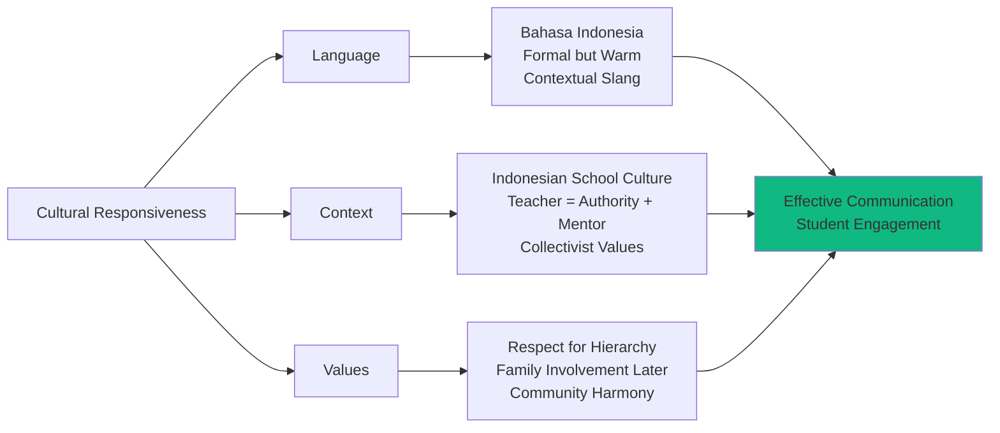

**Implementasi:**
```php
// System Prompt menggunakan Bahasa Indonesia
"Berikan jawaban praktis dan spesifik dalam Bahasa Indonesia 
dengan format HTML menggunakan Tailwind CSS."

// Contoh output AI: "Bapak/Ibu Guru" (respectful address)
```

**Referensi:**
> Ladson-Billings, G. (1995). Toward a theory of culturally relevant pedagogy. *American Educational Research Journal*, 32(3), 465-491.

---

### **3. Constructivist Learning Theory**

**Vygotsky's Zone of Proximal Development (ZPD)** dalam konteks emotional learning:

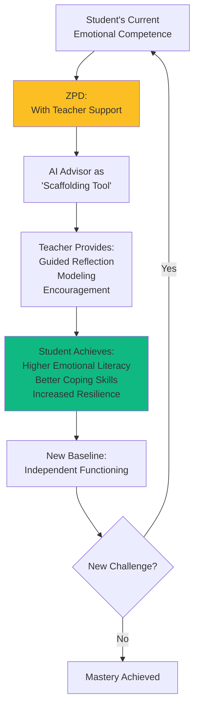

**AI sebagai "More Knowledgeable Other":**
- Bukan mengganti guru, tapi **extend teacher's capacity**
- Memberikan expert knowledge (psikologi) yang guru mungkin tidak punya
- Membantu guru **scaffold** emotional development siswa

**Referensi:**
> Vygotsky, L. S. (1978). *Mind in Society*. Harvard University Press.

---

## 🔄 **Theoretical Workflow: From Detection to Intervention**

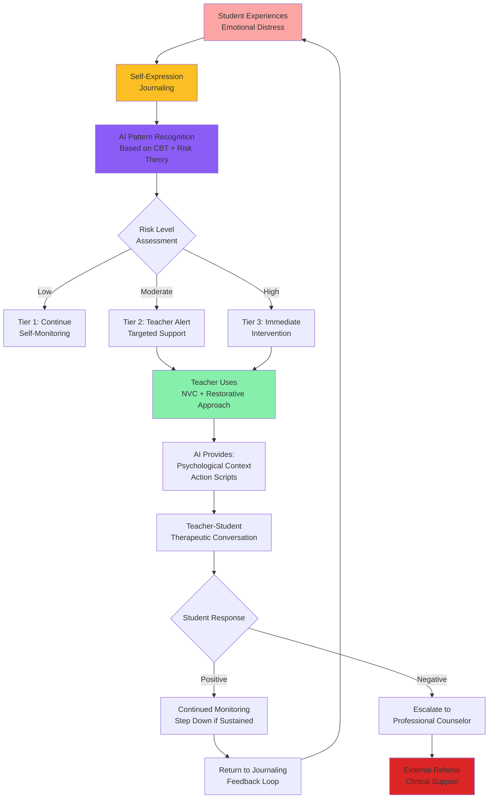

---

## 📖 **Landasan Konseling Sekolah**

### **ASCA National Model** (American School Counselor Association)

Meskipun konteks Indonesia, prinsip-prinsip ASCA universal:

| ASCA Domain | Implementasi Aplikasi | Outcome yang Diharapkan |
|-------------|----------------------|-------------------------|
| **Academic Development** | Monitoring mood → learning correlation | ↑ Academic engagement when emotionally stable |
| **Career Development** | (Future: link stress to career anxiety) | Better self-awareness untuk pilihan karir |
| **Social/Emotional Development** | Core focus: journaling, SEL, risk assessment | ✅ Improved coping skills<br/>✅ Reduced behavioral issues<br/>✅ Stronger peer relationships |

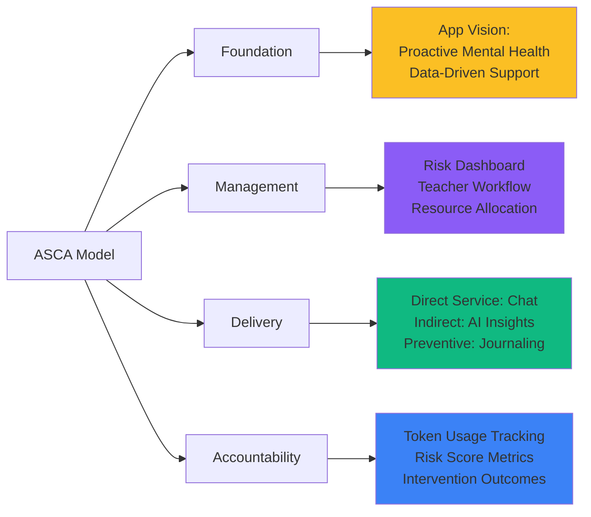

**Referensi:**
> ASCA (2019). *The ASCA National Model: A Framework for School Counseling Programs*. American School Counselor Association.

---

## 🌱 **Positive Psychology Framework**

**Martin Seligman's PERMA Model** untuk well-being:

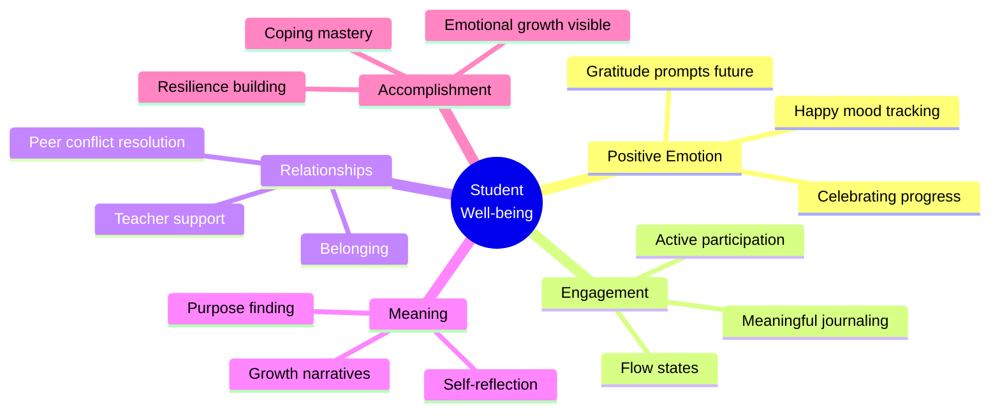

**Shift dari Deficit Model ke Strength-Based:**

| Traditional Deficit Model | Positive Psychology Approach (App) |
|---------------------------|-----------------------------------|
| ❌ "Apa yang salah dengan siswa ini?" | ✅ "Apa kekuatan siswa yang bisa diperkuat?" |
| ❌ Focus on pathology | ✅ Focus on resilience + growth |
| ❌ Fix problems after crisis | ✅ Build protective factors preventively |

**Referensi:**
> Seligman, M. E. P. (2011). *Flourish: A Visionary New Understanding of Happiness and Well-being*. Free Press.

---

## 🔍 **Evidence-Based Risk Assessment**

### **Columbia Suicide Severity Rating Scale (C-SSRS) Inspired**

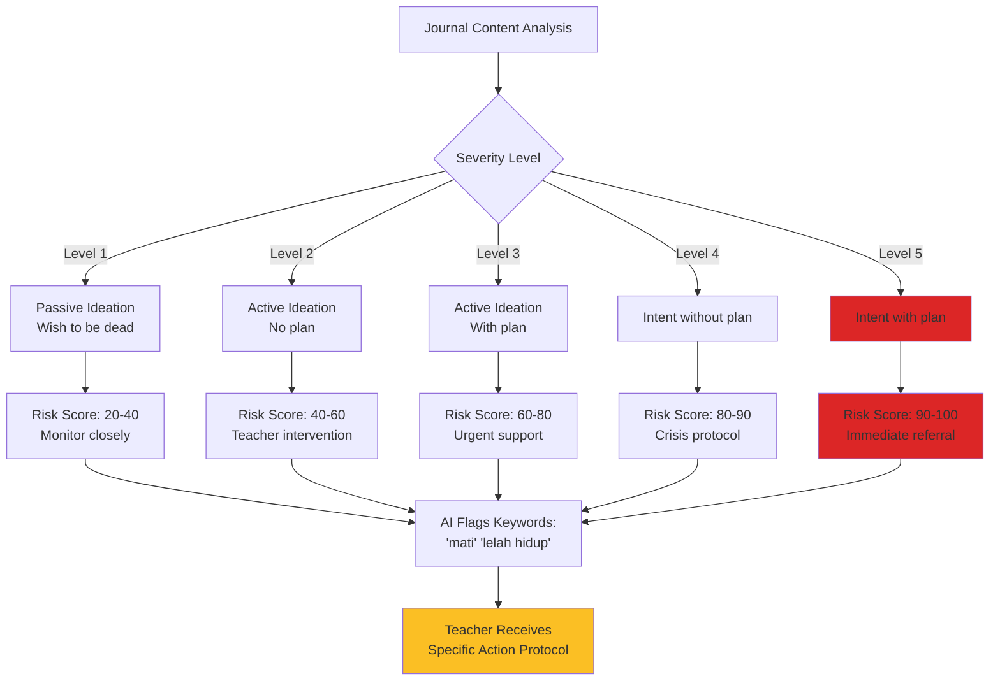

**Keywords dari RiskAssessmentService.php:**
```php
$criticalKeywords = [
    'mati', 'bunuh diri', 'sakit hati', 
    'benci hidup', 'lukai', 'darah'
];
// Score += 30 (high impact)

$warningKeywords = [
    'sedih', 'marah', 'capek', 
    'bingung', 'takut', 'cemas'
];
// Score += 10
```

**Catatan Etis:** Aplikasi **tidak menggantikan** clinical assessment, hanya **screening tool** untuk referral.

**Referensi:**
> Posner, K., et al. (2011). The Columbia-Suicide Severity Rating Scale. *American Journal of Psychiatry*, 168(12), 1266-1277.

---

## 🎯 **Learning Outcomes (Expected)**

### **Untuk Siswa:**

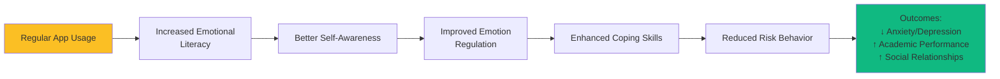

**Measurable Indicators:**
- ✅ % siswa yang consistent journaling (engagement)
- ✅ Risk score trends over time (effectiveness)
- ✅ Mood distribution shifts (well-being improvement)

---

### **Untuk Guru:**

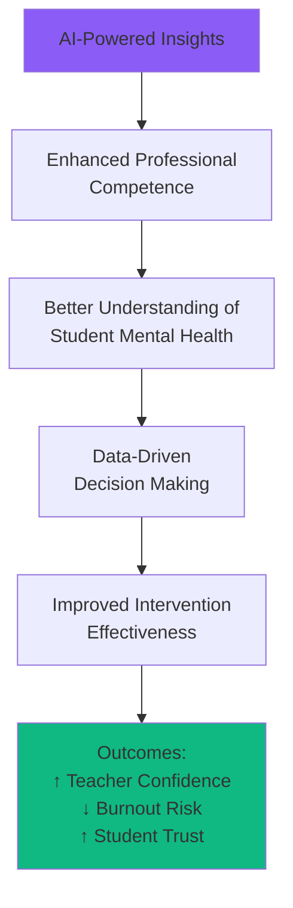

**Professional Development:**
- Teacher belajar psychological frameworks (NVC, Restorative Justice)
- Develop **therapeutic communication skills**
- Understand **trauma-informed approaches**

---

## 📚 **Rekomendasi Kajian Lanjutan**

### **Aspek yang Perlu Riset Lebih Dalam:**

1. **Validity & Reliability Study**
   - Uji validitas risk scoring algorithm
   - Correlation antara risk score vs actual clinical diagnosis
   - False positive/negative rates

2. **Efficacy Research**
   - Pre-post intervention studies
   - Control group comparison (schools with vs without app)
   - Longitudinal tracking (1-2 tahun)

3. **Cultural Adaptation**
   - Apakah NVC effective dalam konteks budaya Indonesia?
   - Perlu modifikasi untuk collectivist culture?

4. **Ethical Guidelines**
   - Data privacy dalam konteks minor consent
   - Teacher responsibility boundaries
   - AI bias detection & mitigation

---

## 🏆 **Kesimpulan Teoretis**

Aplikasi **Mental Health App (SerenityHub)** merepresentasikan **konvergensi** antara:

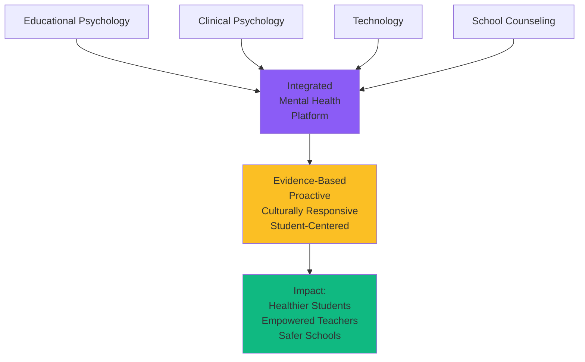

### **Kontribusi Teoretis:**

1. ✅ **Menjembatani Theory-Practice Gap** dalam konseling sekolah
2. ✅ **Demokratisasi akses** ke expert psychological knowledge (via AI)
3. ✅ **Preventive paradigm shift** dari reactive ke proactive
4. ✅ **Data-driven evidence** untuk mental health intervention

### **Alignment dengan SDGs:**

| SDG Target | Kontribusi Aplikasi |
|------------|---------------------|
| **SDG 3:** Good Health & Well-being | Mental health support untuk siswa |
| **SDG 4:** Quality Education | Removing emotional barriers to learning |
| **SDG 10:** Reduced Inequalities | Equal access to mental health resources |

---

## 📝 **Referensi Utama**

1. **MTSS & RTI:**
   - McIntosh, K., & Goodman, S. (2016). *Integrated Multi-Tiered Systems of Support*. Guilford Press.

2. **SEL Framework:**
   - CASEL (2020). *CASEL's SEL Framework*. Collaborative for Academic, Social, and Emotional Learning.
   - Durlak, J. A., et al. (2011). The impact of enhancing students' social and emotional learning. *Child Development*, 82(1), 405-432.

3. **Restorative Justice:**
   - Zehr, H. (2015). *The Little Book of Restorative Justice*. Good Books.
   - Morrison, B. E. (2007). Restoring safe school communities. *Federation Press*.

4. **NVC:**
   - Rosenberg, M. B. (2015). *Nonviolent Communication: A Language of Life*. PuddleDancer Press.

5. **Trauma-Informed Care:**
   - SAMHSA (2014). *Trauma-Informed Approach and Trauma-Specific Interventions*. U.S. Department of Health and Human Services.

6. **Ecological Systems:**
   - Bronfenbrenner, U. (1979). *The Ecology of Human Development*. Harvard University Press.

7. **Self-Determination Theory:**
   - Ryan, R. M., & Deci, E. L. (2000). Self-determination theory. *American Psychologist*, 55(1), 68-78.

8. **CBT:**
   - Beck, J. S. (2011). *Cognitive Behavior Therapy: Basics and Beyond*. Guilford Press.

9. **School Counseling:**
   - ASCA (2019). *The ASCA National Model*. American School Counselor Association.

10. **Positive Psychology:**
    - Seligman, M. E. P. (2011). *Flourish*. Free Press.

11. **Suicide Risk Assessment:**
    - Posner, K., et al. (2011). Columbia-Suicide Severity Rating Scale. *American Journal of Psychiatry*, 168(12), 1266-1277.

---

## 🎓 **Penutup**

Dokumentasi ini menunjukkan bahwa aplikasi **Mental Health App** bukan sekadar "tech project", melainkan **implementasi rigorous educational and psychological theories** dalam bentuk digital. Setiap fitur teknis memiliki **justifikasi pedagogis** yang kuat, dan keseluruhan sistem dirancang dengan prinsip **evidence-based practice**.

**Strength utama:** Integrasi AI bukan untuk "replace" human judgment, tapi untuk **augment** kemampuan guru dalam memberikan support yang lebih informed, empathetic, dan efektif kepada siswa.

---

**Disusun berdasarkan analisis mendalam terhadap kode aplikasi dan best practices dalam pendidikan kesehatan mental.**
